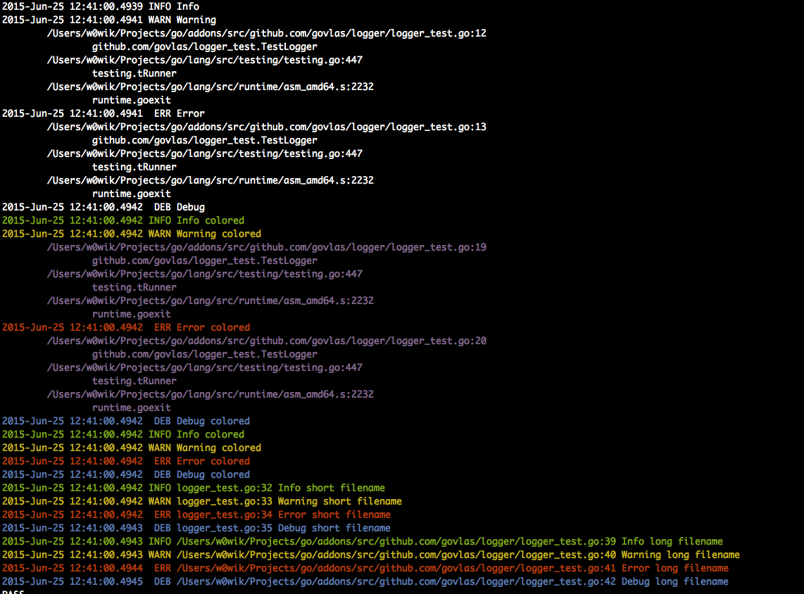

# logger

Simple colored logger

To install:

    go get github.com/govlas/logger

Dependencies:

	go get github.com/fatih/color
	go get github.com/shiena/ansicolor

[See docs for usage](https://godoc.org/github.com/govlas/logger)
